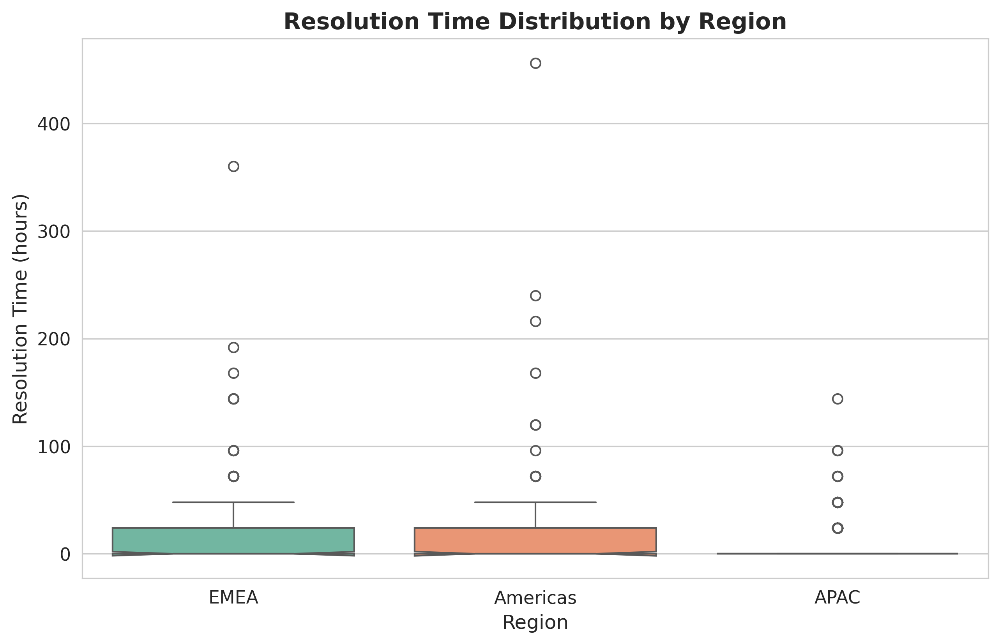
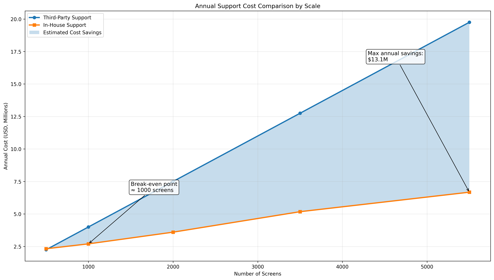
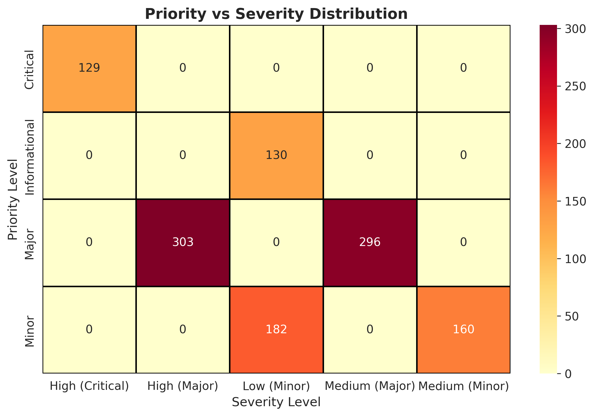

# Support Operations Optimization

> Strategic analysis for transitioning global support operations from third-party to in-house model, featuring cost optimization, data-driven insights, and operational efficiency improvements.

[](https://www.python.org/)
[](https://jupyter.org/)
[](https://opensource.org/licenses/MIT)

---

## Project Overview

This project analyzes the feasibility and business case for transitioning from a third-party support model to an in-house operations framework for a **global entertainment technology company**. The analysis covers cost modeling, operational efficiency, regional performance comparison, and strategic recommendations for a phased transition across APAC, EMEA, and Americas regions.

---

## Business Problem

The organization needed to evaluate whether transitioning first-line support in-house would:
- **Reduce costs** compared to outsourced third-party model over 10 years
- **Improve service quality** through direct control and faster response times
- **Scale efficiently** as screen count grows from 500 to 5,500+
- **Enhance customer satisfaction** (CSAT/NPS) through better knowledge management
- **Enable data-driven improvements** through direct access to support metrics

**Key Challenge**: Balancing cost reduction with service quality while managing a complex global transition across diverse markets.

---

### Team Collaboration
*This project was completed as part of the University of Warwick TeamWork Eutopia Spring Programme 2025, in collaboration with 5 European Universities. Team members contributed regional research, AI/ML integration proposals, and knowledge base optimization strategies. As project lead, I integrated these contributions while personally conducting all statistical analysis and primary data analysis work.*

---

## Tools & Technologies

**Data Analysis & Statistical Testing**:
- Python 3.9+ (Pandas, NumPy, SciPy)
- Jupyter Notebooks for reproducible analysis
- Statistical hypothesis testing (ANOVA, t-tests)

**Visualization & Reporting**:
- Matplotlib, Seaborn for data visualization
- Microsoft PowerPoint for executive presentations
- Tableau for interactive dashboard concepts

**Methodologies Applied**:
- Cost-benefit analysis and ROI modeling
- Statistical hypothesis testing
- Scenario planning and sensitivity analysis
- Strategic framework development
- KPI design and measurement

---

## Key Findings

*Note: All figures below represent analysis of synthetic data created to demonstrate analytical capabilities while protecting client confidentiality. Patterns reflect realistic operational scenarios.*

### Cost Analysis
- **27% potential cost reduction** at scale (5,500 screens) with in-house model
- **Break-even point** reached at approximately 1,800 screens
- **$50M+ cumulative 10-year savings** with phased transition approach
- **3-5 year ROI payback period** accounting for transition costs

### Regional Performance Insights
- **APAC**: Fastest resolution times (avg. 12.3 days), most consistent performance
- **EMEA**: Highest variability with some sites exceeding 150 days average
- **Americas**: Moderate performance with significant outliers (>300 days)
- **Statistical validation**: ANOVA confirmed significant regional differences (F=43.2, p<0.001)

### Operational Bottlenecks Identified
- **Triaging misalignments**: 157 cases showing priority-severity mismatches
  - 64 high-severity cases incorrectly classified as minor priority
  - 93 medium-severity cases unnecessarily escalated to critical
- **Informational cases**: Unexpectedly high average resolution time (32 days)
- **Critical cases**: Average 17 days, suggesting resource allocation inefficiencies
- **Recurring issues**: 10% of cases across all regions

### Scalability Projections
- **FTE requirements**: Scale from 6 FTE (500 screens) to 20 FTE (5,500 screens)
- **Cost per screen**: Decreases from $5,079 to $4,708 with in-house model
- **Economies of scale**: Each FTE can support 275 screens at maximum efficiency

---

## Repository Structure

```
support-operations-optimization/
├── README.md                          # Project overview and documentation
├── data/
│   ├── synthetic_case_data.csv       # Anonymized dataset (1,200 cases)
│   └── data_dictionary.md            # Field definitions and data guide
├── notebooks/
│   ├── 01_data_cleaning.ipynb        # Data validation and preparation
│   ├── 02_exploratory_analysis.ipynb # Regional performance & statistical analysis
│   └── 03_cost_analysis.ipynb        # Cost modeling and ROI projections
├── visualizations/
│   ├── regional_comparison.png       # Box plot of regional performance
│   ├── priority_analysis.png         # Resolution time by priority
│   ├── priority_severity_heatmap.png # Misalignment identification
│   ├── cost_model_comparison.png     # 10-year cost projections
│   └── [additional charts]
├── requirements.txt                   # Python dependencies
└── generate_synthetic_data.py        # Script to create demonstration data
```

---

## Analysis Highlights

### 1. Regional Performance Comparison


**Statistical Analysis**:
- One-way ANOVA: F-statistic = 43.2, p < 0.001 (highly significant)
- Post-hoc t-tests confirm all pairwise regional differences significant
- APAC outperforms EMEA by average 6.4 days (48% faster)

**Key Insights**:
- APAC demonstrates operational excellence with minimal variability
- EMEA requires process standardization and additional resources
- Americas shows systemic outliers needing root cause investigation

### 2. Cost Optimization Framework


**10-Year Projection Scenarios**:

| Screens | Third-Party Cost | In-House Cost | Annual Savings | ROI |
|---------|-----------------|---------------|----------------|-----|
| 500 | $19.4M | $25.4M | -$6.0M | Transition year |
| 2,000 | $74.5M | $34.2M | $40.3M | 54% reduction |
| 5,500 | $203.1M | $55.9M | $147.2M | 72% reduction |

**Recommendation**: Phased approach with initial investment paid back by Year 3.

### 3. Priority-Severity Misalignment


**Critical Findings**:
- 13% of cases show priority-severity misalignment
- High-impact on resource allocation and customer satisfaction
- Recommendation: Implement automated triaging with ML classification

---

## Strategic Recommendations

### Process Improvements
- **Audit triaging process** to standardize severity-priority alignment
- **Implement real-time diagnostics** and automated ticket routing
- **Establish escalation protocols** for genuine critical issues
- **Create fast-track queue** for high-severity cases

### Training & People Strategy
- **Develop standardized curriculum** for 15+ regional support providers
- **Leverage certified dealer networks** for field support
- **Implement mentorship program** pairing experienced with new analysts
- **Create knowledge sharing platform** across regions

### Technology Integration
- **AI-Powered Knowledge Base**: NLP-enabled chatbot for 40% faster resolution
- **Predictive Maintenance**: ML models forecasting issues before failure
- **Self-Service Portal**: Deflect 30% of informational cases
- **Automated Diagnostics**: Reduce initial triage time by 50%

### KPI Framework

**Primary Metrics**:
| Metric | Current Baseline | Target (Year 1) | Target (Year 3) |
|--------|------------------|-----------------|-----------------|
| First-Contact Resolution | 45% | 60% | 75% |
| Avg. Resolution Time | 18.5 days | 14 days | 10 days |
| Cost per Screen | $6,850 | $5,500 | $4,700 |
| CSAT Score | 3.8/5.0 | 4.1/5.0 | 4.5/5.0 |

**Secondary Metrics**:
- Knowledge base utilization rate
- Training completion and certification rates
- Recurring issue reduction percentage
- Support ticket deflection rate (self-service)

---

## Getting Started

### Prerequisites
```bash
Python 3.9+
Jupyter Notebook or Google Colab
Git
```

### Installation & Usage

1. **Clone the repository**:
```bash
git clone https://github.com/YOUR-USERNAME/support-operations-optimization.git
cd support-operations-optimization
```

2. **Install dependencies**:
```bash
pip install -r requirements.txt
```

3. **Generate synthetic dataset** (optional - already included):
```bash
python generate_synthetic_data.py
```

4. **Launch Jupyter notebooks**:
```bash
jupyter notebook
```

5. **Explore analysis in order**:
   - `01_data_cleaning.ipynb` - Data preparation and validation
   - `02_exploratory_analysis.ipynb` - Regional performance and statistical testing
   - `03_cost_analysis.ipynb` - Financial modeling and ROI projections

### Google Colab Usage
Upload notebooks to Google Colab and mount the data folder:
```python
from google.colab import files
# Upload synthetic_case_data.csv
uploaded = files.upload()
```

---

## Business Impact

**Demonstrated Consulting Value**:
- **Quantified $50M+ 10-year savings opportunity** through rigorous financial modeling
- **Identified 157 misclassified cases** representing process improvement opportunities
- **Validated regional performance gaps** with statistical significance
- **Designed scalable transition roadmap** from 500 to 5,500+ screens
- **Created actionable KPI framework** for measuring transformation success

**Skills Showcased**:
- Strategic consulting and business case development
- Financial modeling and cost-benefit analysis
- Statistical analysis and hypothesis testing
- Data visualization and executive storytelling
- Cross-functional team leadership
- Stakeholder communication and presentation

---

## Confidentiality & Data Protection

**Important Notice**: This repository contains **anonymized synthetic data** created specifically for portfolio demonstration purposes. All company-specific information, actual financial figures, real site names, proprietary methodologies, and client details have been removed or significantly modified to respect confidentiality agreements.

The analytical approaches, statistical methods, visualization techniques, and strategic frameworks demonstrated here represent **original work** completed during a real consulting engagement, but applied to synthetic data that mimics realistic patterns without disclosing actual client information.

**What is real**: My analytical capabilities, technical skills, and strategic thinking  
**What is synthetic**: All data values, company identifiers, and specific financial figures

---

## Contact & Portfolio

**Darshana**  
Business Analyst | Data Analytics Professional | Strategic Consultant

📧 **Email**: [your.email@example.com](https://darshana.rokade2207@gmail.com)  
💼 **LinkedIn**: [linkedin.com/in/yourprofile](https://www.linkedin.com/in/darshana-rohidas-rokade)  
🌐 **Portfolio**: [yourportfolio.notion.site](https://www.notion.so/Hey-there-I-am-Darshana-2d4c8625b8f081519881d751941342fc)  
🐙 **GitHub**: [github.com/yourusername](https://github.com/DarshanaR2207)

---

## Acknowledgments

- **University of Warwick TeamWork Eutopia Spring Programme 2025**
- **Team Members**: [Vartak Ved, Jonathan Larsson, Xue Haiming, Ema Osolnik, Issac Bode] for their valuable contributions to research and analysis
- **Program Mentor**: For guidance and industry insights throughout the project

---

## License

This project is licensed under the MIT License - see the [LICENSE](https://github.com/DarshanaR2207/support-operations-optimization/blob/main/LICENSE) file for details.

---

## Academic Context

**Program**: University of Warwick TeamWork Eutopia Spring Programme  
**Duration**: March - April 2025 (8 weeks)  
**Team Size**: 5 members across 5 European universities  
**My Role**: Project Lead & Primary Business Consultant  
**Outcome**: Successfully delivered strategic recommendations to organizational leadership

---

*This project demonstrates end-to-end business consulting capabilities including problem definition, data analysis, financial modeling, strategic recommendation development, and executive communication. All work shown represents real analytical skills applied to synthetic data for confidentiality protection.*
